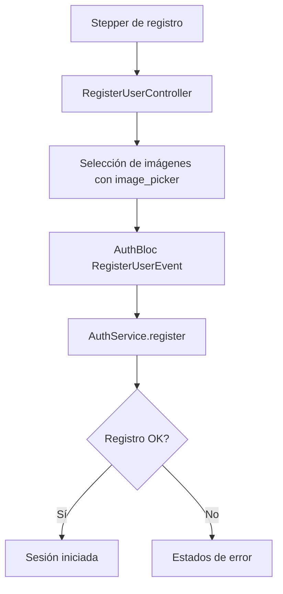
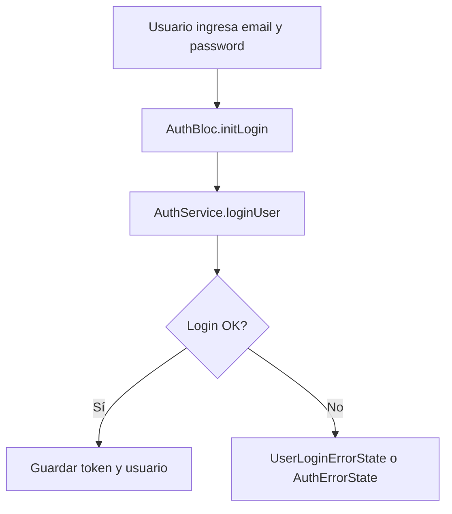

# 🚗 Inri Driver

Aplicación Flutter para conductores con autenticación, registro con carga de imágenes, permisos de notificaciones, geolocalización y publicación Android automatizada con GitHub Actions.

## 📋 Índice

- [Descripción general](#-descripción-general)
- [Stack actual](#-stack-actual)
- [Arquitectura actual](#-arquitectura-actual)
- [Flujos principales](#-flujos-principales)
- [Manejo de errores](#-manejo-de-errores)
- [Estructura del proyecto](#-estructura-del-proyecto)
- [Configuración y arranque](#-configuración-y-arranque)
- [Release Android / Google Play](#-release-android--google-play)

## 🎯 Descripción general

El proyecto implementa la app de conductores de Inri Driver. Hoy el foco real del código está en:

- autenticación y renovación de sesión
- registro de conductores
- carga de fotos del carnet desde galería
- permisos de notificaciones
- geolocalización y background service
- tarifas cargadas desde assets
- release Android automatizado por GitHub Actions

## 🧰 Stack actual

### Dependencias principales verificadas

Según `/Users/luis/Desktop/driver_uber/pubspec.yaml`, el proyecto usa actualmente:

```yaml
dependencies:
  bloc: ^9.0.0
  flutter_bloc: ^9.1.0
  hydrated_bloc: ^10.0.0
  http: ^1.1.0
  http_parser: ^4.0.2
  flutter_secure_storage: ^9.0.0
  connectivity_plus: ^5.0.2
  geolocator: ^14.0.2
  geocoding: ^3.0.0
  flutter_map: ^7.0.0
  flutter_local_notifications: ^19.0.3
  flutter_background_service: ^5.0.5
  flutter_background_service_android: ^6.2.2
  google_fonts: ^8.1.0
  image_picker: ^1.1.2
  permission_handler: ^12.0.1
  provider: ^6.1.1
  socket_io_client: ^3.1.2
  webview_flutter: ^4.5.0
```

## 🏗️ Arquitectura actual

La app sigue principalmente un enfoque basado en BLoC + Services + Controllers.

```text
UI / Pages / Widgets
        ↓
Bloc Layer
        ↓
Controllers / Services
        ↓
API / Storage / Background / Device features
```

### Componentes importantes

- `AuthBloc`: login, registro, errores de autenticación, sesión
- `ImagesBloc`: estado simple del flujo de imágenes
- `NotificationBloc`: permisos de notificaciones
- `AddressBloc`, `LocationBloc`, `MapBloc`: ubicación y flujo operativo del conductor
- `AuthService`: login, register, renew, serialización de respuesta
- `RegisterUserController`: armado de formulario y selección de imágenes
- `StorageService`: token, user id, estado de notificaciones, ordenes notificadas

## 🔐 Flujos principales

### 1) Registro de conductor



### 2) Login



### 3) Carga de imágenes

El proyecto usa `image_picker` para seleccionar imágenes desde galería.

- no depende de permisos amplios de lectura de fotos en el manifest
- el flujo actual está alineado con selección puntual desde el picker del sistema
- las rutas de archivo seleccionadas se guardan en `RegisterUserController`

## ⚠️ Manejo de errores

El proyecto tiene manejo tipado de errores de autenticación.

### Excepciones disponibles

- `NetworkException`
- `ServerException`
- `ClientException`
- `ValidationException`
- `ParseException`
- `TimeoutException`
- `StorageException`
- `UnknownAuthException`

### Estados de error relevantes

Verificados en `/Users/luis/Desktop/driver_uber/lib/blocs/user/auth_state.dart`:

```dart
UserRegisterErrorState(
  message: '...',
  errorCode: '...',
)

UserLoginErrorState(
  message: '...',
  errorCode: '...',
)

AuthErrorState(
  message: '...',
  errorCode: '...',
  errorType: AuthExceptionType.network,
)
```

### Campos reales del estado

El `AuthState` actual expone:

```dart
final bool? authenticando;
final Usuario? usuario;
final String? errorMessage;
final String? errorCode;
final bool hasError;
final AuthExceptionType? errorType;
```

## 🧱 Estructura del proyecto

```text
lib/
├── blocs/
│   ├── user/
│   ├── images/
│   ├── base/
│   └── ...
├── controllers/
├── exceptions/
├── models/
├── pages/
│   ├── register_login/
│   ├── images_acces.dart
│   ├── notifications_access.dart
│   └── ...
├── repositories/
├── routes/
├── service/
├── styles/
├── utils/
├── validation/
└── widgets/
    ├── dialogs/
    ├── error_handling/
    ├── forms/
    └── ...
```

## 🚀 Configuración y arranque

### Assets relevantes

En `pubspec.yaml` están declarados:

- `assets/car2.webp`
- `assets/icon.webp`
- `assets/remis.webp`
- `assets/map.webp`
- `assets/fontana.webp`
- `assets/barranqueras.webp`
- `assets/logo.png`
- `assets/background_image.webp`
- `assets/car_b.png`
- `assets/tarifas.json`

### Arranque real de la app

El `main()` actual:

- inicializa Flutter bindings
- carga tarifas desde `assets/tarifas.json`
- inicializa `HydratedBloc.storage`
- configura locale `es_ARG`
- ajusta símbolos numéricos
- registra múltiples blocs en `MultiBlocProvider`

### Ejemplo resumido

```dart
void main() async {
  WidgetsFlutterBinding.ensureInitialized();

  final tarifas = await TarifarioLoader.cargarDesdeAssets();

  HydratedBloc.storage = await HydratedStorage.build(
    storageDirectory: kIsWeb
      ? HydratedStorageDirectory.web
      : HydratedStorageDirectory((await getTemporaryDirectory()).path),
  );

  Intl.defaultLocale = 'es_ARG';
  initializeDateFormatting('es_ARG', '');

  runApp(
    MultiBlocProvider(
      providers: [
        BlocProvider(create: (_) => AuthBloc(
          authService: AuthService(),
          registerUserController: RegisterUserController(),
        )),
        BlocProvider(create: (_) => ImagesBloc()),
        BlocProvider(create: (_) => NotificationBloc()),
        // ... otros blocs
      ],
      child: const MyApp(),
    ),
  );
}
```

## 📱 Release Android / Google Play

### Workflow actual

El release Android se ejecuta con:

- `/Users/luis/Desktop/driver_uber/.github/workflows/main.yml`

Ese workflow:

- compila un `appbundle`
- restaura keystore desde GitHub Secrets
- puede subir a Google Play

### Inputs del workflow

- `track`
- `build_name`
- `build_number`
- `dry_run`

### Estado actual del proyecto

Configuración Android relevante verificada:

- `compileSdkVersion 36`
- `targetSdkVersion 35`
- versión del repo: `2.0.4+14`

### Nota importante sobre Play

Para evitar rechazos por policy, la app ya no declara permisos amplios de lectura de fotos en el manifest. El flujo actual está pensado para selección puntual de imágenes mediante picker del sistema.

## 📝 Notas de mantenimiento

- El README debe reflejar el código real, no una arquitectura idealizada.
- Si cambia el flujo de registro, imágenes o release, actualizar este archivo.
- Si cambia el workflow de Play, revisar también inputs y documentación de publicación.
